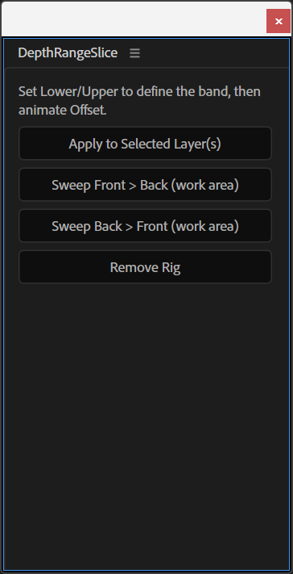

# After Effects Scripts

- [Hex Swap](#hex-swap) — `Hex Swap.jsx`
- [Depth Range Slice](#depth-range-slice) — `DepthRangeSlice.jsx`

## Hex Swap

`Hex Swap.jsx`

Dockable ScriptUI panel that finds colors by hex code across a project (or across the comps/folders selected in the Project panel) and swaps them in bulk.

**What it does**

- Scans shape fills/strokes (gradients report-only), text fill/stroke colors — including per-character and animator colors — comp backgrounds, solids, lights, layer styles, effect colors, Color Control/pseudo-effect rigs, and Essential Properties.
- Optionally includes nested precomps when scope is "Selected", and keyframed colors, with a per-channel tolerance slider (0–64) for near-matches.
- Two color modes: **Standard** (matches the color picker's stored value) or **Linear** (matches rendered output in linearized projects).
- Three-step workflow — **Scan** to survey, **Preview** to see what would change (opens a report), **Apply** to commit (wrapped in one undo group; status line points to **Last Report**, which can be copied or saved as `.txt`).
- Swap lists can be saved/loaded as `.json` or plain `#OLD > #NEW` `.txt`; all settings persist automatically via `app.settings`, with a **Reset to Defaults** button.
- Expressions are intentionally skipped and listed in the report rather than overwritten.

**Install**

Copy `Hex Swap.jsx` to `<After Effects>/Support Files/Scripts/ScriptUI Panels/`, restart AE, then open it from **Window > Hex Swap.jsx**. For **Copy**, **Save**, and **Load** to work, enable Preferences → Scripting & Expressions → "Allow Scripts to Write Files and Access Network".

**Usage**

1. Set scope (Entire Project or Project-panel selection) and which categories to search under **1 Setup**.
2. Run **2 Scan** to see what hex colors exist, or paste/build a swap list under **3 Swap**.
3. Click **Preview** to review the report, then **Apply Swaps** to commit.

Built and tested on After Effects 26.3 (Windows). See [Hex Swap - Developer Notes.md](Hex%20Swap%20-%20Developer%20Notes.md) for the internal code map, AE quirks discovered during development, and a testing hook — useful reading before extending the script.

## Depth Range Slice

`DepthRangeSlice.jsx`

ScriptUI panel that turns a rendered depth pass into an animated reveal/slice effect.

**What it does**

- Applies a Levels rig to the selected layer(s) that remaps a chosen band of grey values (the "Lower Grey" / "Upper Grey" sliders) in a depth pass to full black → full white, with an `Offset` control that shifts the band and a `Gamma` control for the falloff.
- The band is a fixed width, so animating `Offset` sweeps it through the depth range, past both ends — useful for reveals, X-ray-style sweeps, or depth-based wipes.
- **Sweep Front → Back** / **Sweep Back → Front** buttons auto-keyframe the offset across the comp's work area with eased in/out.
- **Remove Rig** cleanly strips all the added effects back off the layer.
- Works at any bit depth (values are normalized 0–1 internally).

**Install**

Copy `DepthRangeSlice.jsx` to `<After Effects>/Support Files/Scripts/ScriptUI Panels/`, restart AE, then open it from **Window > DepthRangeSlice.jsx**. It can also be run once via **File > Scripts > Run Script File**.

**Usage**

1. Render or import a depth pass (e.g. a Redshift/Arnold/V-Ray Z-depth AOV — see [AOV Set Depth](../Cinema%204D%20Scenes/README.md#aov-set-depth) for an example Redshift setup) as a layer.
2. Select the layer(s) and click **Apply to Selected Layer(s)**.
3. Adjust Lower/Upper Grey to set the band width and position, then animate `Offset` (or use the Sweep buttons).
