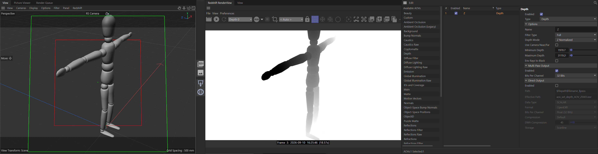

# Cinema 4D Scenes

## aov_set_depth.c4d

Reference scene showing a correctly configured Redshift **Depth AOV** for use with depth-based compositing tools (e.g. [DepthRangeSlice.jsx](../After%20Effects%20Scripts/)).

**What it shows**

- A test rig with a Redshift Depth AOV added, set to **Z Normalized** mode.
- Explicit Minimum/Maximum Depth range so the normalized output uses the full 0–1 range instead of clipping.
- 32-bit float multi-pass output, ready to render alongside beauty.

**Usage**

Open the scene in Cinema 4D with the Redshift renderer and inspect the AOV settings in the Redshift RenderView / AOV manager to see the exact configuration, or copy the AOV setup into your own scene.
