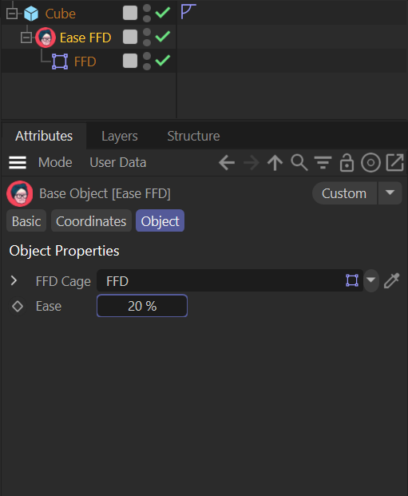

# Cinema 4D Plugins

- [Safe Delete Object](#safe-delete-object) — `SafeDeleteObject/`
- [Ease FFD](#ease-ffd) — `EaseFFD/`

## Safe Delete Object

`SafeDeleteObject/SafeDeleteObject.pyp` (Python command plugin, no UI)

Adds a **Safe Delete Object** command (under **Extensions**) that checks what else in the scene references the selected object before deleting it, instead of deleting blind.

**What it does**

1. Scans the entire document — every object, every tag, XPresso node graphs, and the active Render Settings (sky/background/foreground/floor/camera links) — for anything that links to the selected object: instances, Boole/Symmetry/Cloner sources, Target/Constraint tags, spline references, and more.
2. If nothing references it, deletes it immediately.
3. If something does, shows a confirmation dialog listing every reference by name before deleting anything.
4. If you cancel, it instead selects the referencing object(s) in the Object Manager so you can see exactly where the object is used.
5. Children of the deleted object are **not** deleted — they're reparented one level up, matching Cinema's standard "Delete" (not "Delete With Children") behavior, so nothing downstream silently vanishes.
6. The whole operation (reparenting, render-data changes, the delete itself) is wrapped in one undo step.

**Install**

Drop the whole `SafeDeleteObject` folder into Cinema 4D's plugins directory (**Edit > Preferences > Open Preferences Folder > plugins**), then restart Cinema 4D. It appears as **Safe Delete Object** under **Extensions**.

**Usage**

Select an object and run **Extensions > Safe Delete Object** instead of the regular Delete key when you're not sure what else in the scene might be pointing at it.

**Notes**

- `PLUGIN_ID` in `SafeDeleteObject.pyp` is a personal-use placeholder. If it collides with another installed plugin, Cinema warns in the Console — pick a different ID ≥ 1000000, or register a real one at plugincafe.maxon.net before distributing.
- XPresso and Take System references are scanned on a best-effort basis — the node-graph scan is wrapped defensively since node internals vary more between Cinema 4D versions than the regular object API. Always double-check the Console after using this on a scene with complex XPresso setups.
- Render Settings references (e.g. an object set as the Sky or Background object) can't be highlighted in the Object Manager since Render Settings isn't a selectable object — the plugin tells you to check **Edit > Render Settings** directly in that case.

## Ease FFD

`EaseFFD/EaseFFD.pyp` (Python object plugin)

Adds an **Ease** slider to a Free-Form Deformation cage that blends between a sharp, local, corner-for-corner deformation and the native FFD's smooth global Bernstein/Bezier result — something stock FFD can't do at any cage density.



- **Ease = 0%** — sharp, exactly follows the cage (local trilinear interpolation across the nearest cell)
- **Ease = 100%** — identical to native FFD (same global Bernstein/Bezier math stock FFD always uses)
- **0–100%** — blend of the two
- **>100%** — allowed, extrapolates past native smoothness

Works correctly on animated geometry: it reads each frame's already-animated point cache fresh, so there's no risk of compounding deformation.

### Install

Drop the whole `EaseFFD` folder into Cinema 4D's plugins directory (**Edit > Preferences > Open Preferences Folder > plugins**), then restart Cinema 4D. It appears as **Ease FFD** wherever your plugin menu lands (e.g. Create > Object).

### Required hierarchy

**The FFD cage must be linked into the "FFD Cage" field on the Ease FFD object — that link is what matters, not where the FFD sits in the Object Manager.** Two hierarchy patterns both work:

**Simple (single object) — as pictured above:**

```
Cube
└── Ease FFD      <- child of the object it deforms
    └── FFD        <- parked here for tidy organization; linked via "FFD Cage"
```

Add **Ease FFD** as a direct child of the object you want deformed (the classic way native deformers like Bend/Twist/FFD are used), and park the FFD cage as a child of the Ease FFD object itself. Link the FFD into the **FFD Cage** field and set **Ease** to taste.

**Multi-object (siblings under a shared parent):**

```
Null
├── Tube
├── Object 1..30   <- any number of siblings, can be independently animated
└── Ease FFD       <- must be LAST, linked to the FFD below

FFD                 <- separate branch, NOT nested under the same Null
```

To deform multiple sibling objects at once (all combined, every frame, including their own animation — exactly like native FFD), put **Ease FFD** as the *last* child under a shared parent, after every object it should affect. In this pattern, keep the FFD cage in a **separate** location — its own Null, or parked at the root — rather than nested under that same parent. Keep the FFD fully **enabled**: with no preceding siblings of its own to act on, its native deformation has nothing to do, so it stays enabled (cage fully visible and live-editable) without ever double-deforming the geometry.

### Usage

1. Set up the hierarchy above and link the FFD cage into the **FFD Cage** field on the Ease FFD object.
2. Adjust **Ease** (0–300%) to blend between sharp and smooth.

### Notes

- `PLUGIN_ID` in `EaseFFD.pyp` is a personal-use placeholder. If it collides with another installed plugin, Cinema warns in the Console — pick a different ID ≥ 1000000, or register a real one at plugincafe.maxon.net before distributing.
- If deformation looks scrambled/spiky rather than smoothly wrong, the FFD's internal point ordering doesn't match the plugin's assumption — flip `FFD_ORDER` in `EaseFFD.pyp` from `0` to `1`.
- Pure Python, evaluated per-vertex per-grid-point. Keep the FFD's own grid resolution modest (5–15 points per axis) for interactive speed — the mesh resolution of the deformed object matters much less than the FFD grid size.
