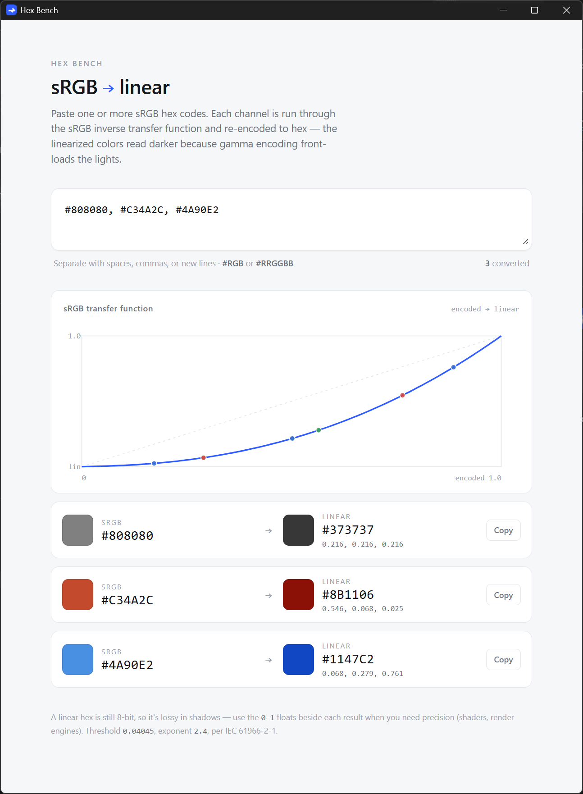

# Hex Bench

Small Windows utility for converting sRGB hex color codes to linear-light values.

## What it does

Paste one or more sRGB hex codes (`#RGB` or `#RRGGBB`, separated by spaces/commas/newlines) and each channel is run through the sRGB inverse transfer function (threshold `0.04045`, exponent `2.4`, per IEC 61966-2-1) and re-encoded back to hex, alongside the raw 0–1 float values. Useful for getting correct linear-light values for shaders and render engines from a color picked in an sRGB-space tool.

## Usage

Run `hex_bench.exe`, paste your hex code(s) into the input box, and read the converted linear hex + float values below. Click **Copy** to grab a result.
